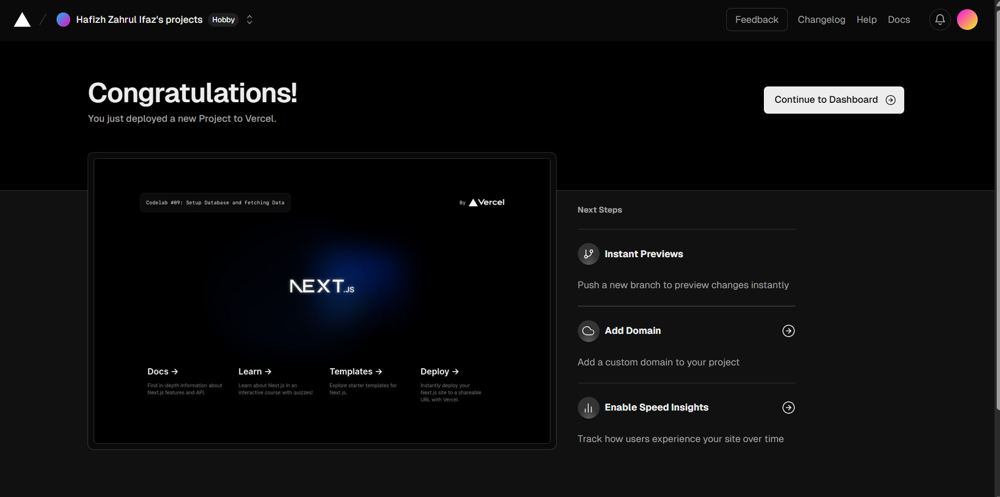
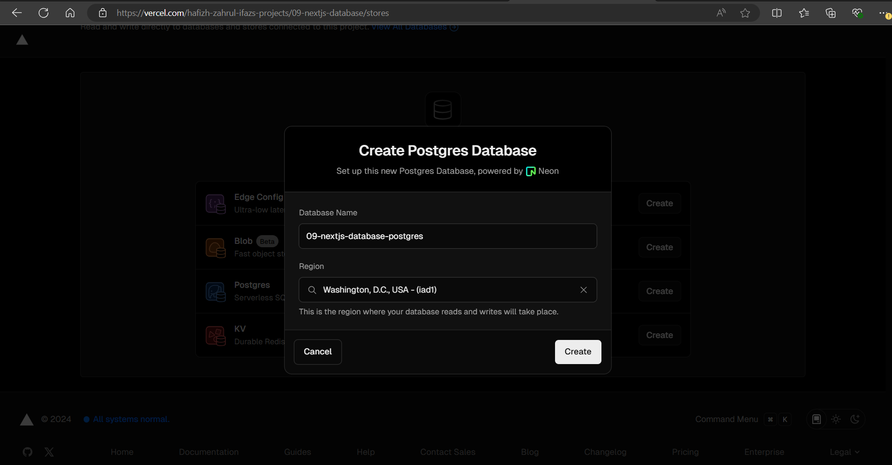

This is a [Next.js](https://nextjs.org/) project bootstrapped with [`create-next-app`](https://github.com/vercel/next.js/tree/canary/packages/create-next-app).

## Getting Started

First, run the development server:

```bash
npm run dev
# or
yarn dev
# or
pnpm dev
# or
bun dev
```

Open [http://localhost:3000](http://localhost:3000) with your browser to see the result.

You can start editing the page by modifying `app/page.tsx`. The page auto-updates as you edit the file.

This project uses [`next/font`](https://nextjs.org/docs/basic-features/font-optimization) to automatically optimize and load Inter, a custom Google Font.

## Practicum 1


## Soal 1
Capture hasil deploy project Anda (vercel) dan buatlah laporan di file README.md. Jelaskan apa yang telah Anda pelajari? 

    ~ We can utilize Vercel to build robust and responsive web applications, leveraging its powerful infrastructure and rapid deployment capabilities. By connecting a GitHub repository, Vercel automatically redeploys our Next.js applications into production with high speed and reliability whenever changes are made to the main branch, with no additional configuration required.



