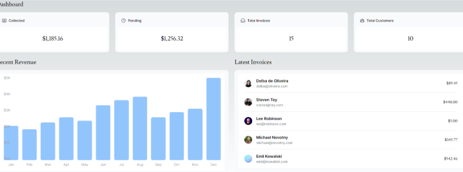

This is a [Next.js](https://nextjs.org/) project bootstrapped with [`create-next-app`](https://github.com/vercel/next.js/tree/canary/packages/create-next-app).

## Getting Started

First, run the development server:

```bash
npm run dev
# or
yarn dev
# or
pnpm dev
# or
bun dev
```

Open [http://localhost:3000](http://localhost:3000) with your browser to see the result.

You can start editing the page by modifying `app/page.tsx`. The page auto-updates as you edit the file.

This project uses [`next/font`](https://nextjs.org/docs/basic-features/font-optimization) to automatically optimize and load Inter, a custom Google Font.

## Practicum 1


## Soal 1
Capture hasil deploy project Anda (vercel) dan buatlah laporan di file README.md. Jelaskan apa yang telah Anda pelajari? 

    ~ We can utilize Vercel to build robust and responsive web applications, leveraging its powerful infrastructure and rapid deployment capabilities. By connecting a GitHub repository, 
    Vercel automatically redeploys our Next.js applications into production with high speed and reliability whenever changes are made to the main branch, with no additional configuration required.


## Soal 2
Capture hasil basis data Anda dan buatlah laporan di file README.md. Jelaskan apa yang telah Anda pelajari?

    ~We can create an online database on Vercel and use Postgres, a serverless SQL solution, for our project. To connect our project to this database on Vercel, we need to configure a `.env`
     file to store private configurations. It's crucial to ensure that the `.env` file is included in the `.gitignore` list to prevent it from being exposed when pushing to our GitHub repository.


## Soal 3
Capture hasil npm run seed Anda dan buatlah laporan di file README.md. Jelaskan apa yang telah Anda pelajari ?

    ~We can seed our database using the command npm run seed, which is defined in the scripts section of the package.json file 
    and runs the command node -r dotenv/config ./src/seeder/seed.js. Occasionally, issues may arise during the initial run, such as problems with dependencies or file paths.


## Soal 4
Capture hasil query Anda dan buatlah laporan di file README.md. Jelaskan apa yang telah Anda pelajari ? Cobalah eksekusi query SQL yang lain sesuai kreasi Anda, capture hasilnya dan jelaskan!

    ~The invoices and customer tables are related through the foreign key `customer_id`. This relationship allows us to join the two tables and view their combined results.


## Soal 5

Lakukan push, kemudian perhatikan di akun dashboard Vercel project Anda. Capture dan lampirkan link aplikasi Anda yang telah berhasil di deploy, kemudian buatlah laporan di file README.md. Jelaskan apa yang telah Anda pelajari ?

    ~Vercel automatically deploys the latest version of our app from our GitHub repository. On my Vercel dashboard, it reviews the code and deploys it automatically.


## Soal 6

Lakukan capture dan push hasilnya, kemudian buatlah laporan di file README.md. Jelaskan apa yang telah Anda pelajari ?

    ~The revenue graph is set to display 12 months, but the label for the last month (December) is being placed in a new column below. 


## Soal 7

Lakukan capture dan push hasilnya, kemudian buatlah laporan di file README.md. Jelaskan apa yang telah Anda pelajari ?

    ~The customer photos are saved in the public directory. Since these photos are not generated when creating a new project, we need to source them ourselves.

